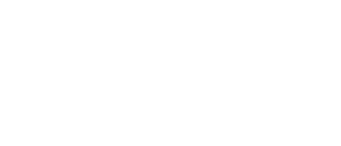

<h1 align="center">🚀 Emanuel Rodrigues</h1> 

**`Junior Full-Stack Developer / Graphic Designer`**

Welcome to my GitHub profile where you'll see my journey as I learn and carve my path into the world of Full-Stack Programming.

## 📫 Reach me

---

 
<h3>⛰️ Manu's Coding Journey</h3>

I began my coding journey in college, as a multimedia student. It was mainly frontend and some ideas of backend, nothing too deep. I was pretty excited, even before starting. However, things took a turn for the worst, and shortly after starting learning, I discovered that coding wasn't for me... at the time. So I moved on to other realms of multimedia and ended up as a Graphic Designer. It fulfilled me for a while but after some time, I've noticed that it wasn't for me either. I love being creative and I don't think I'll ever let go of that part of me... but I wanted more. As I started to realize that I needed a career change, coding started to appear on the back of my mind. You see, I've never truly forgotten it after college, and it somehow became this monster that was too strong for me to defeat. But maybe not this time. Maybe I was ready enough to try again. And so I did. And so I failed. A few months passed. I tried again on my own. And I failed again. This made me think that maybe I should stick to Graphic Design and what I needed was just to fall back in love with it. And that's what I did, but the love didn't last long. At this point, I was really tired, like you must be from reading this. I promise the end is near. I've decided I needed a proper change, this time for real, not like the times before where it was just me in front of my computer. In reality, coding was still on my mind. I always had this idea that programmers owned the world and the array of things they could do blew my mind. And I wanted that. Since I couldn't do it alone, I took a friend's suggestion and did a coding boot camp. It was hard, incredibly fast-paced but fun as hell. They say "third time's a charm" and... this time was. I finally felt I was on to something, and even though this journey was, is, and will continue to be hard, I don't see myself doing anything else. So welcome to my GitHub profile and my journey into a Full-Stack Developer!!!

#

### 🧰 Languages and Tools

#

### 📺 IDEs

#

### 🎨 Design

#

### ⚡️ Stats

#

