

    

        
    

<h3>🎨 I'm a Graphic Designer turned Full-Stack Developer! 💻<h3>
<h4> Welcome to my GitHub profile where you'll see my exciting journey as I learn and carve my path into the world of Full-Stack Programming.</h4>
 
 
 

    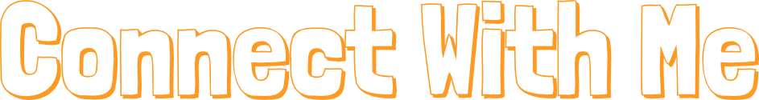

    
    
    <a href="https://www.iamvilares.com/">
        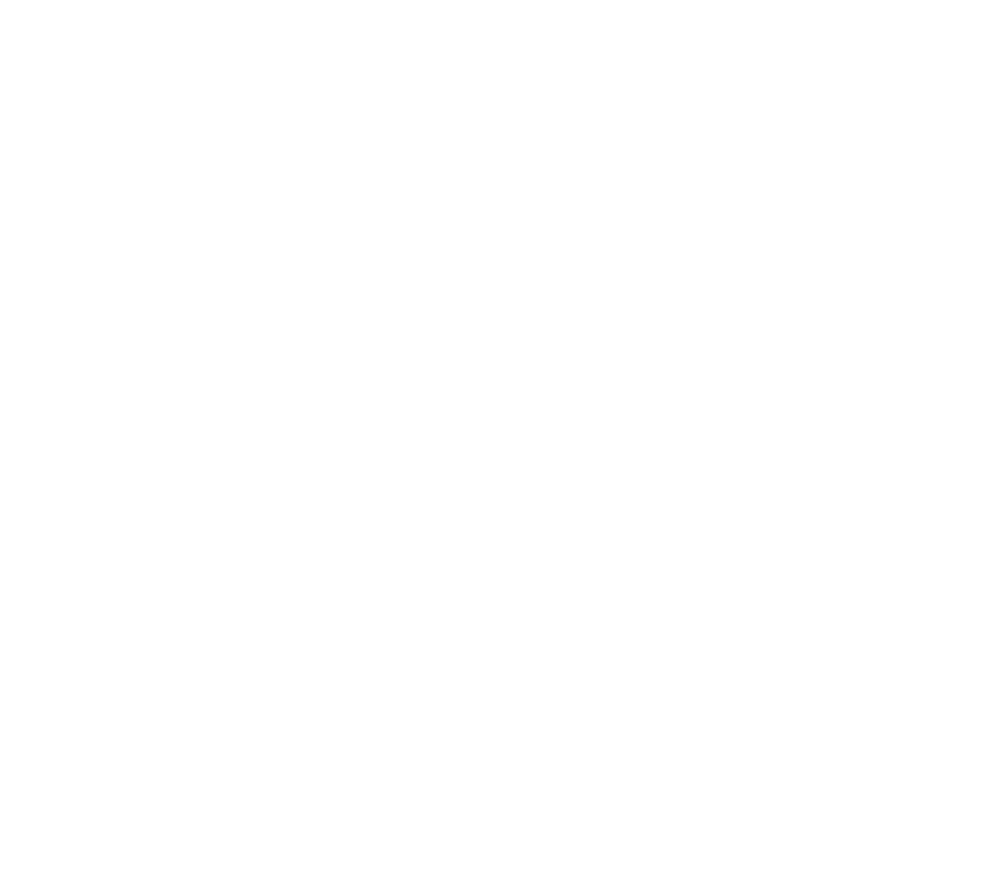
    </a>

 
 
 
 

    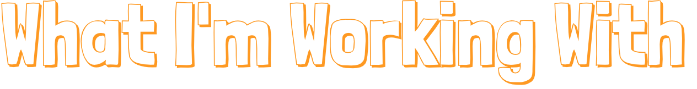

<h2>💻 Programming Languages</h2>
 

    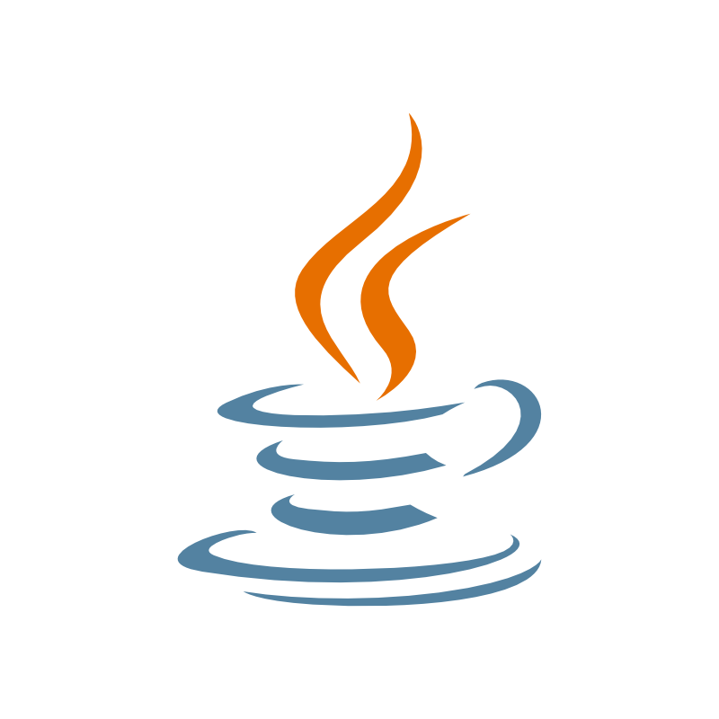
    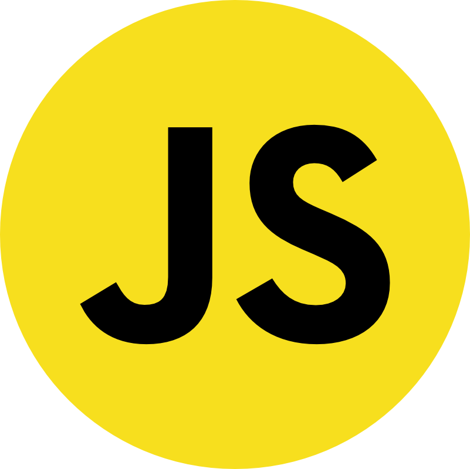
    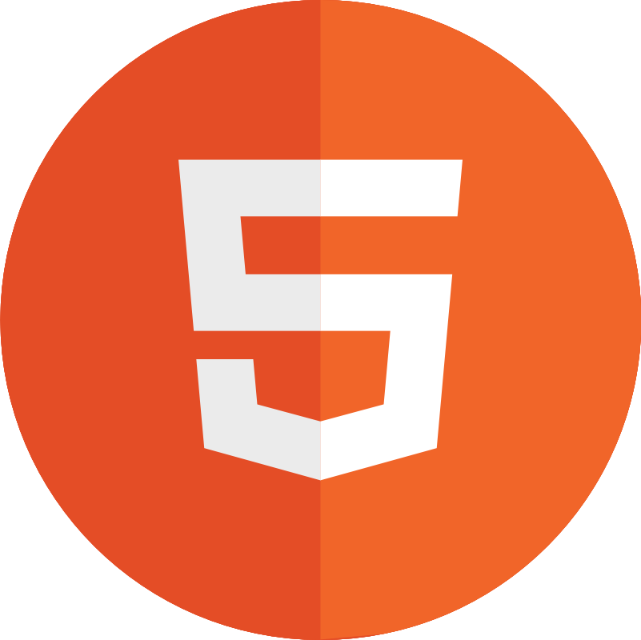
    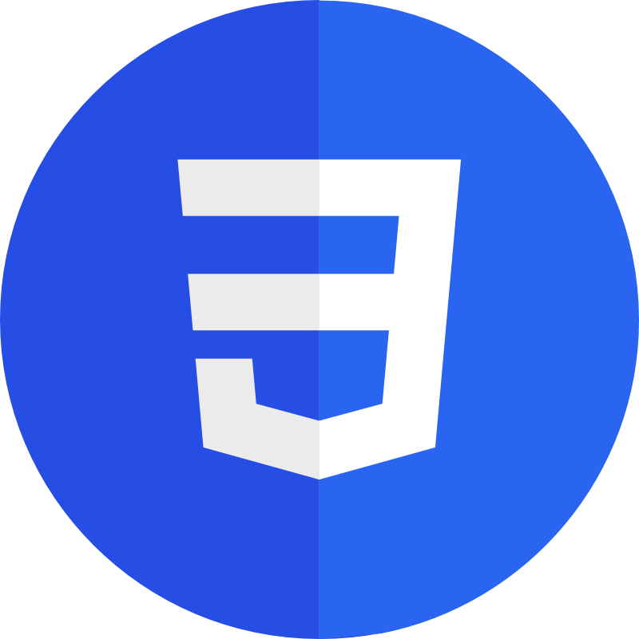

 
<h2>🚀 Tools</h2>
 
 

    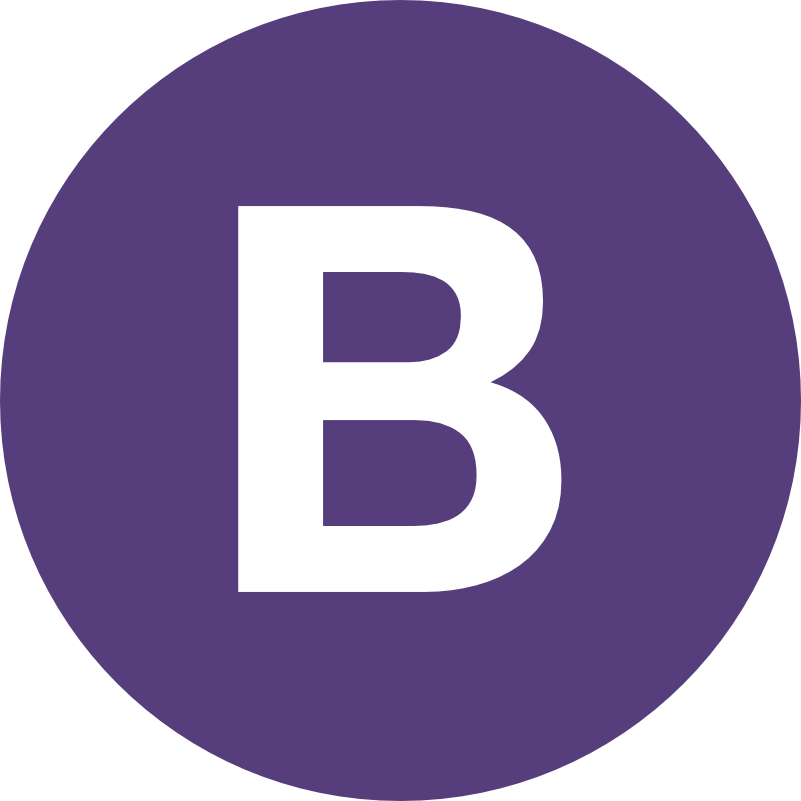
    
    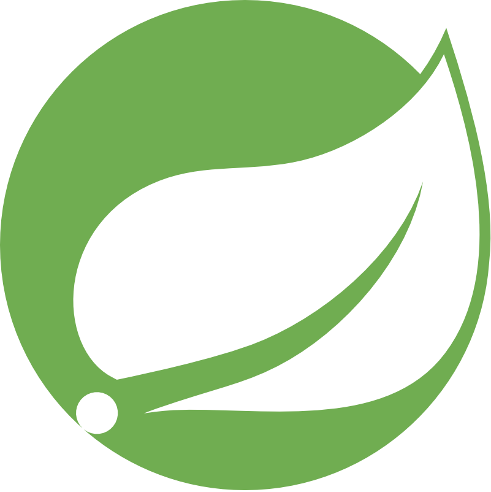
    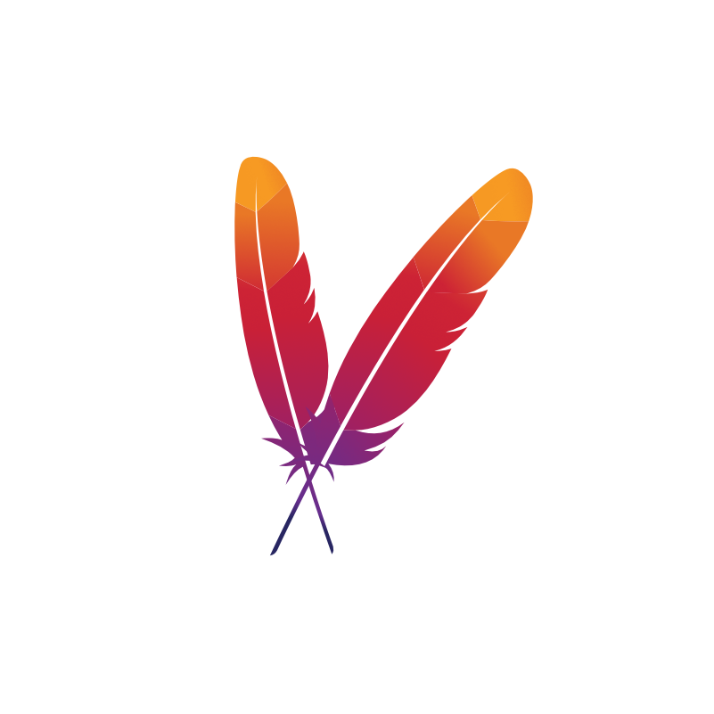
    

 
 

    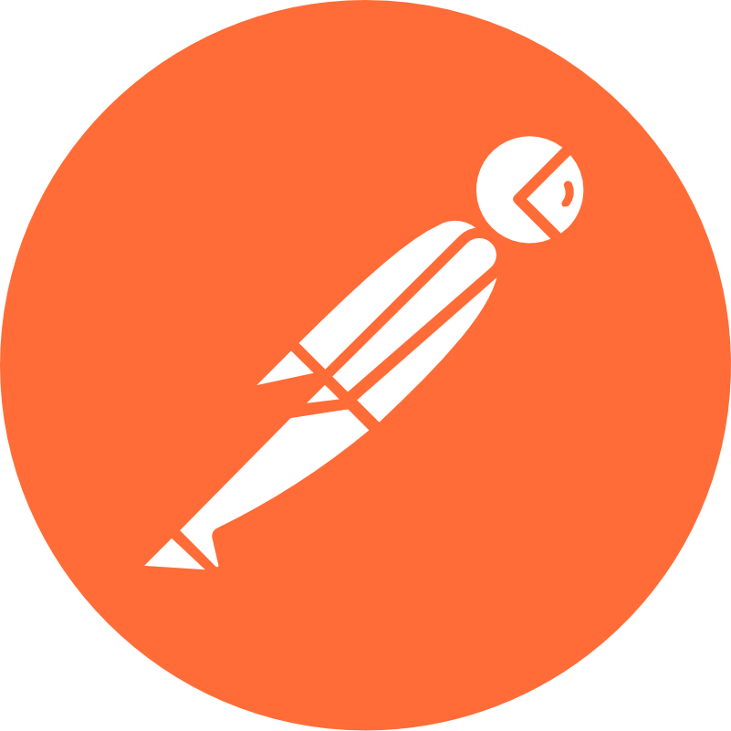
    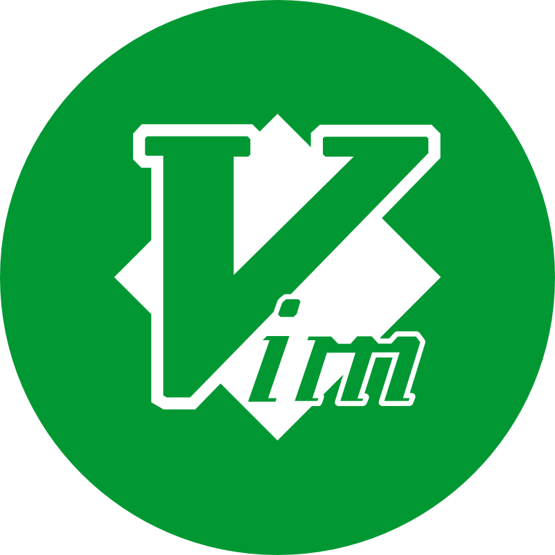
    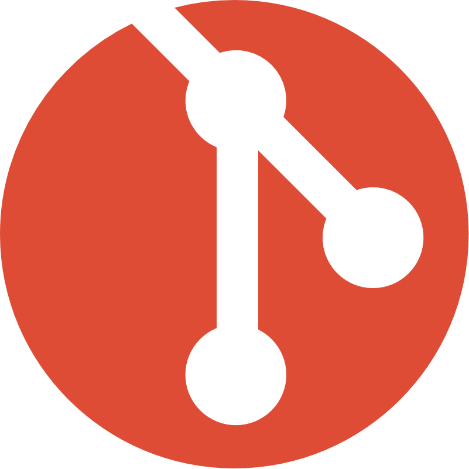
    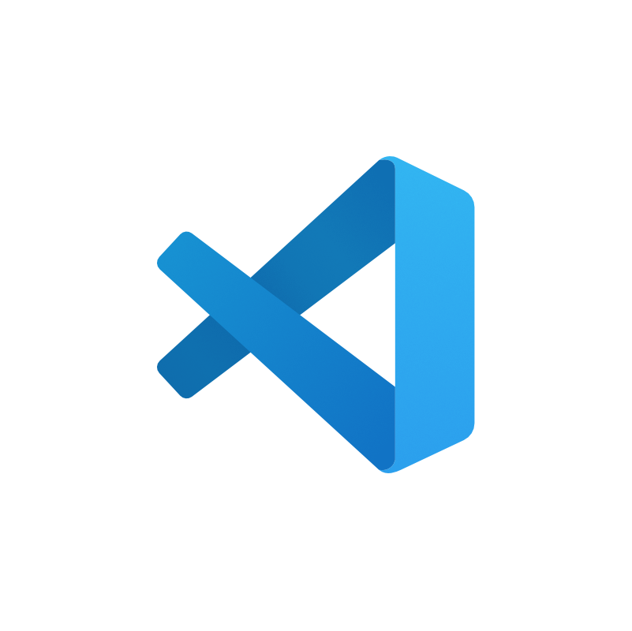
    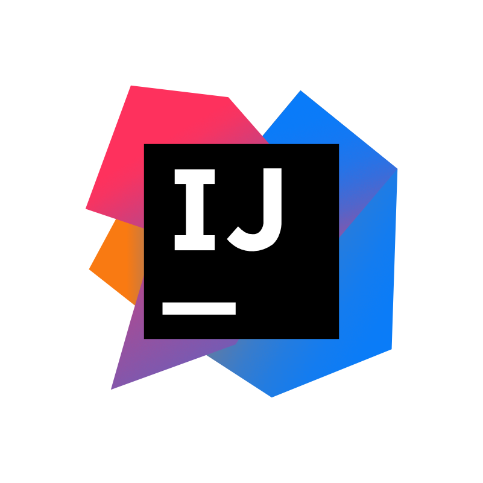

<!--
**ManuVils/manuvils** is a ✨ _special_ ✨ repository because its `README.md` (this file) appears on your GitHub profile.

Here are some ideas to get you started:

- 🔭 I’m currently working on ...
- 🌱 I’m currently learning ...
- 👯 I’m looking to collaborate on ...
- 🤔 I’m looking for help with ...
- 💬 Ask me about ...
- 📫 How to reach me: ...
- 😄 Pronouns: ...
- ⚡ Fun fact: ...
-->
